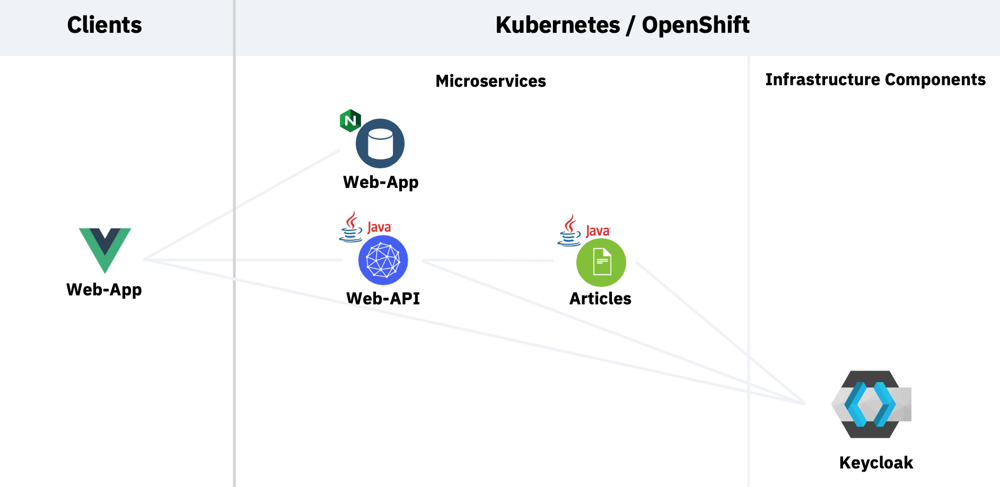

## Workshop: Application Security

xxx **UNDER CONSTRUCTION** xxx

In this workshop you'll learn how get startet with Application Security from two perspectives.

* Platform configurations 
* Authentication and Authorization implementations

The code is available as open source as part of the [Cloud Native Starter](https://github.com/IBM/cloud-native-starter/tree/master/reactive) project. 

The workshop shows on a sample application how to leverage with Keycloak application security with authentication and authorization in Quarkus applications, and how to apply security provided by the platform with IBM Cloud.

The workshop uses a sample application to demonstrate security functionality. The sample application displays links to articles and author information.

The following screenshot shows the web application, you have to logon to see the list of articles.

<kbd></kbd>

### Architecture

The following architecture diagram shows the sample application which contains a web application, which invokes an API of the Web-API Microservice and that Microservice does invoke Articles microservice. 

To see the results in the web application, users need to be authenticated and they need to have the role `user`. In the picture below you see the architecture.

<kbd></kbd>

### Estimated time and level

|  Time | Level  |
| - | - |
| one hour | beginners |

### Objectives

After you complete this workshop, you'll understand the following [application security](https://en.wikipedia.org/wiki/Application_security) related topics:

**Application security provided by the platform**
* [TLS](https://en.wikipedia.org/wiki/Transport_Layer_Security)/[HTTPS](https://en.wikipedia.org/wiki/HTTPS)
* [MTLS](https://en.wikipedia.org/wiki/Mutual_authentication)

**Application security with Keycloak**
* [Authentication](https://en.wikipedia.org/wiki/Authentication) on the Web Fronted
* [Authorization](https://en.wikipedia.org/wiki/Authorization) for specific Microservices in the Backend

*The intention of this workshop is not to explain every aspect of application security.*

### About this workshop

The introductory page of the workshop is broken down into the following sections:

* [Agenda](#agenda)
* [Compatibility](#compatibility)
* [Technology Used](#technology-used)
* [Credits](#credits)
* [What`s next?](#whats-next?)

### Agenda

These are the sections of this workshop, go through all of them in sequence, start with `Setup the IBM Cloud Environment` :

|   |   |
| - | - |
| [Setup the IBM Cloud Environment](pre-work/README.md) | This section does contain two exercises. |
| [Setup the IBM Cloud application environment](app-env-exercise-01/README.md)  | This section does contain four exercises. |
| [Platform security with MTLS](p-sec-exercise-01/README.md) | This section does contain two exercises. |
| [(Optional) Application security with Keycloak ](app-sec-exercise-01/README.md) | This section does contain three exercises. |

### Compatibility

This workshop has been tested on the following platforms:

* **IBM Cloud Kubernetes Service**: version ...
* **IBM Cloud Shell**: beta

### Technology Used

* [Microservices architecture](https://en.wikipedia.org/wiki/Microservices)
* [KEYCLOAK](https://www.keycloak.org)
* [Jakarta EE](https://jakarta.ee/)
* [MicroProfile](https://microprofile.io/)
* [Quarkus](https://quarkus.io/ingress)
* [Ingress](https://kubernetes.io/docs/concepts/services-networking/ingress/)
* [Istio](https://https://istio.io)
* [Vue.js](https://vuejs.org/)

### Credits

* [Niklas Heidloff](https://twitter.com/nheidloff)
* [Harald Uebele](https://twitter.com/Harald_U)
* [Thomas Südbröcker](https://twitter.com/tsuedbroecker)

### What`s next?

The [blogs]() as well as the [presentation](images/) describe the functionality in more detail.

