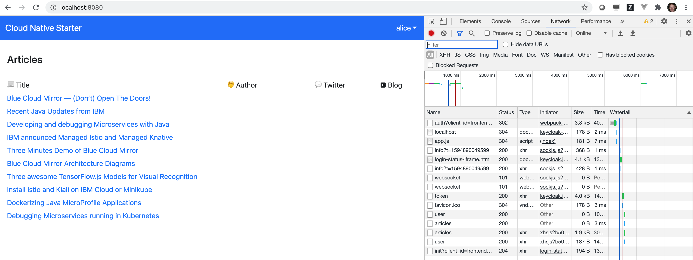
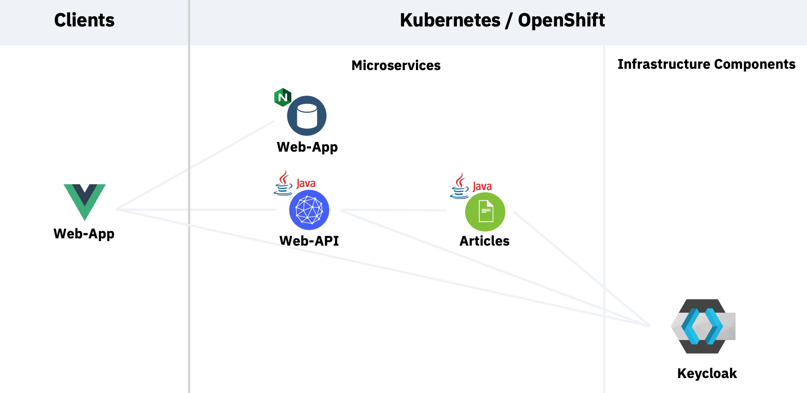

# Workshop: Get started with security for your Java Microservices application

As a developer you should ask yourself: *"How can I make my application (more) secure?"*

In this workshop you will learn how to get started with Application Security from two perspectives:

* Platform security
* Authentication and Authorization implementation

We will show you with an example application:

* How to secure external access to a Kubernetes cluster with TLS
* How to secure communication between Microservices with Istio and mTLS
* How to implement authorization and authentication with the Open Source Identity and Access Management system Keycloak and JSON Web Tokens (JWT)

The exercises are based on an example application based on our Open Source Github project [Cloud Native Starter](https://github.com/IBM/cloud-native-starter/tree/master/security), build with Quarkus and Microprofile

The following screenshot shows the web application, you have to logon to see the list of articles.

### Architecture

The following diagram shows the architecture of the sample application. There is a Web-App service that serves the Javascript/Vue.js code to the browser. The Web-App code running in the browser invokes a REST API of the Web-API microservice. The Web-API microservice in turn invokes a REST API of the Articles microservice.

To see the results in the web application, users need to be authenticated and they need to have the role `user`.

### Estimated time and level

|  Time | Level  |
| - | - |
| one hour | beginners |

### Objectives

After you complete this workshop, you'll understand the following [application security](https://en.wikipedia.org/wiki/Application_security) related topics:

**Application security provided by the platform**

* [TLS](https://en.wikipedia.org/wiki/Transport_Layer_Security)/[HTTPS](https://en.wikipedia.org/wiki/HTTPS)
* [mTLS](https://en.wikipedia.org/wiki/Mutual_authentication)

**Application security with Keycloak and Quarkus**

* [Authentication with Keycloak](https://en.wikipedia.org/wiki/Authentication) on the Web Fronted
* [Authorization in Quarkus](https://en.wikipedia.org/wiki/Authorization) for specific Microservices in the backend

*The scope of this workshop is not to explain every aspect of application security.*

### About this workshop

<!-- The introductory page of the workshop is broken down into the following sections:

* [Agenda](#agenda)
* [Compatibility](#compatibility)
* [Technology Used](#technology-used)
* [Credits](#credits)
* [What`s next?](#whats-next?) -->

### Agenda

These are the sections of this workshop, go through all of them in sequence, start with `1. Setup the IBM Cloud Environment` :

 1. [Setup the IBM Cloud Environment](pre-work/README.md)
 2. [Setup the IBM Cloud application environment](app-env-exercise-01/README.md)
 3. [Platform security with mTLS](p-sec-exercise-01/README.md)
 4. [Application security with Keycloak and Quarkus](app-sec-exercise-01/README.md)

### Compatibility

This workshop has been tested on the following platforms:

* **IBM Cloud Kubernetes Service**: Kubernetes Version 1.17, Istio Version 1.5 on IBM Cloud
* **IBM Cloud Shell**: Version 1.0.2

### Technology Used

* [Microservices architecture](https://en.wikipedia.org/wiki/Microservices)
* [KEYCLOAK](https://www.keycloak.org)
* [Jakarta EE](https://jakarta.ee/)
* [MicroProfile](https://microprofile.io/)
* [Quarkus](https://quarkus.io/ingress)
* [Ingress](https://kubernetes.io/docs/concepts/services-networking/ingress/)
* [Istio](https://https://istio.io)
* [Vue.js](https://vuejs.org/)
* [git 2.24.1 or higher](https://git-scm.com/book/en/v2/Getting-Started-Installing-Git)
* [yarn 1.22.4 or higher](https://yarnpkg.com)
* [Node.js v14.6.0 or higher](https://nodejs.org/en/)
* [Apache Maven 3.6.3](https://maven.apache.org/ref/3.6.3/maven-embedder/cli.html)

### Credits

* [Niklas Heidloff](https://twitter.com/nheidloff)
* [Harald Uebele](https://twitter.com/Harald_U)
* [Thomas Südbröcker](https://twitter.com/tsuedbroecker)

### Additional resources

[Here](BLOGS.md) are some blogs that describe how this project has been implemented-

The presentation that goes with this workshop is available [here](https://github.com/IBM/cloud-native-starter-security-workshop/blob/master/workshop/images/App-Security-Final-V1-20201006.pdf).
