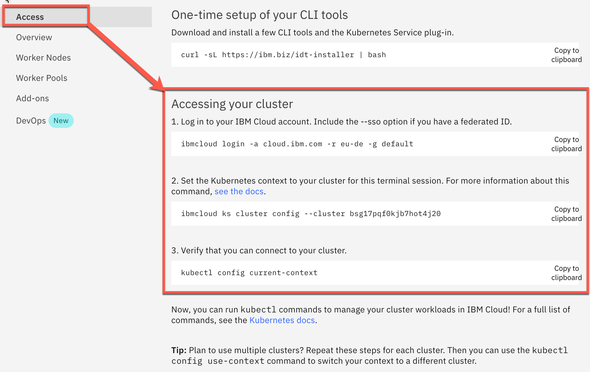
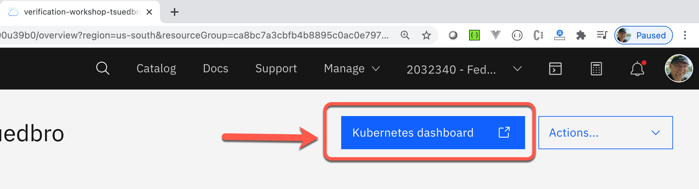
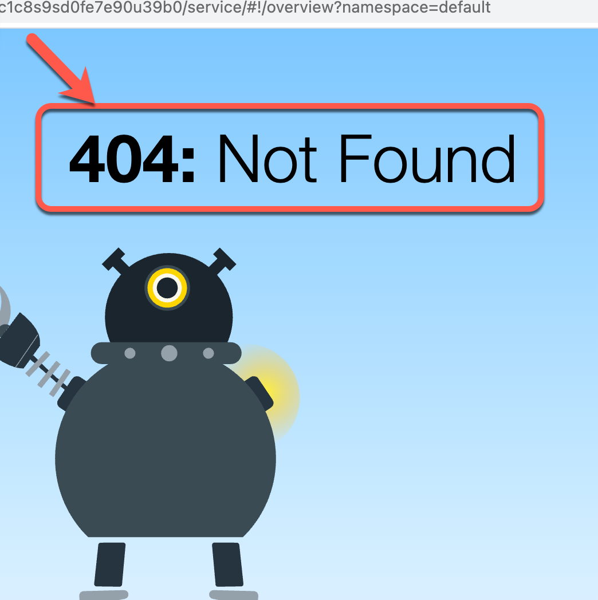
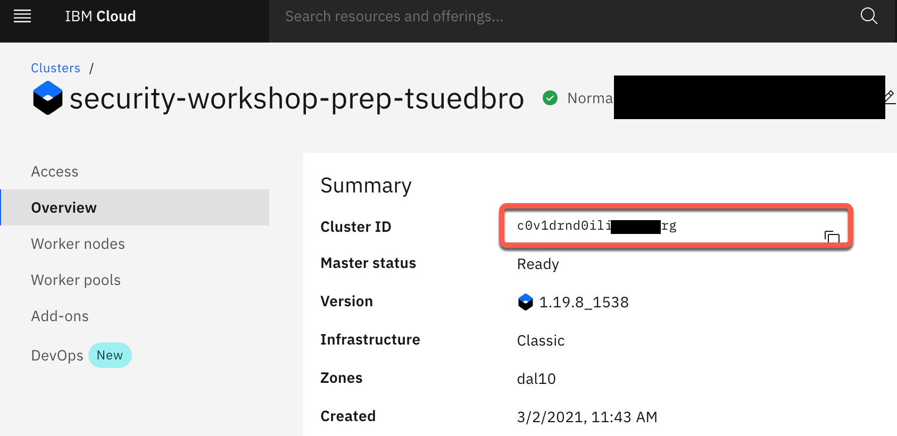
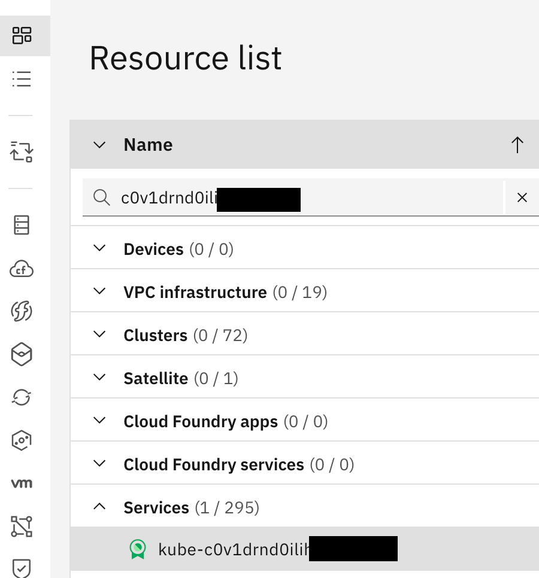
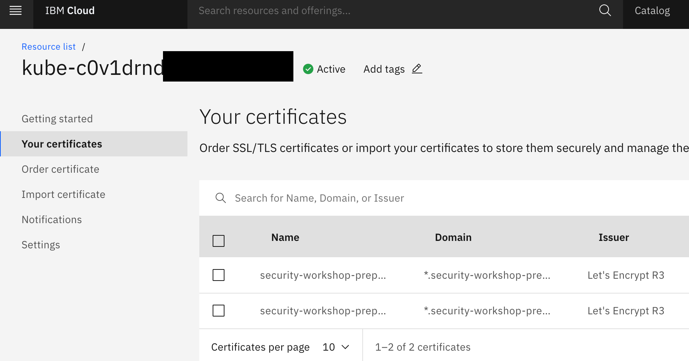

# Additional Information

Here you find additional help, something went wrong, known issues or just get some information.

### **(Issue 1) In case your `Cloud Shell` session was closed**

Setup the major environment variables we need in the workshop.

* **Solution**: Follow these steps to setup the major environment variables we need in the workshop.

#### Step 1: Go back to the open browser tab the open Kubernetes Cluster in the IBM Cloud web console. 

Now select `Access` on the left-hand side, here you see all steps to access your Kubernetes Cluster in a terminal session. You can easily copy and paste the commands. We will use these commands later to access the Kubernetes cluster in the IBM Cloud Shell.



#### Step 2: Setup needed variable you maybe need in your lab

* `ROOT_FOLDER` of your project

```sh
git clone https://github.com/IBM/cloud-native-starter.git
cd cloud-native-starter/security
ROOT_FOLDER=$(pwd)
echo $ROOT_FOLDER
```

* `MYCLUSTER` your cluster name

```sh
export MYCLUSTER=YOUR-CLUSTER
```

* `INGRESSGATEWAYIP` needed to create a `DNS`

```sh
export INGRESSGATEWAYIP=$(kubectl get svc -n istio-system | grep 'istio-ingressgateway' |  awk '{print $4}')
echo $INGRESSGATEWAYIP
```

* `INGRESSSECRET` we use for Istio Ingress Gateway configuration

```sh
export INGRESSSECRET=export INGRESSSECRET=$(ibmcloud ks nlb-dns ls --cluster $MYCLUSTER | grep '0001' | awk '{print $5}')
echo $INGRESSSECRET
```

* `INGRESSURL` we use to access for example the `Cloud Native Starter` application and `Keycloak`

```sh
export INGRESSURL=$(ibmcloud ks nlb-dns ls --cluster $MYCLUSTER | awk '/-0001./ {print $1}')
echo $INGRESSURL
```

### **(Issue 2) You can't access the Kubernetes Dashboard**

When you open up your Kubernetes Dashboard from your cluster from the IBM Cloud WebConsole



and you get following error message:



It cloud be that you are logged on to two different `IBM Cloud Accounts` (your `IBM Cloud account` and the `IBM Cloud workshop account`) in different browser tabs.

* **Solution**:

Just ensure that you are logged on to the IBM Cloud workshop account.


### **(Issue 3) Problems with your `IBM Cloud Account`**

If you have problems with your `IBM Cloud Account` please visit the FAQ page from the [IBM Cloud support](https://cloud.ibm.com/docs/account?topic=account-accountfaqs).

For questions like:

* How do I resolve errors that occur when creating my account?
* Can I sign up for a free trial?
and many more ...

### **(Note) Find the Certificate Manager of your cluster**

IBM Cloud does create for you a free [Certificate Manager](https://cloud.ibm.com/catalog/services/certificate-manager) service instance to manage the certificates for your Kubernetes cluster. 

#### Step 1: Copy the cluster ID



#### Step 2: Find the resources related to this cluster ID



#### Step 3: Inspect the given certificates



