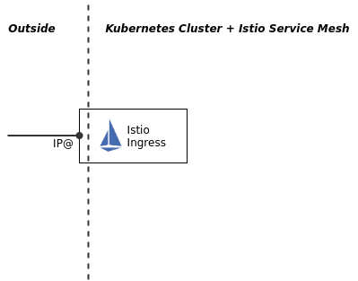

# Expose the Istio Ingress gateway via DNS

The following procedures are platform specific and work with a **"standard classic"** Kubernetes Cluster provided by the IBM Cloud Kubernetes Service (IKS) on the IBM Cloud. 

>If you are using a VPC based or a free ("Lite") Kubernetes Cluster on the IBM Cloud or another Cloud provider or something like Minikube, the following sections will **not** work!

When you install Istio on a Kubernetes Cluster on IBM Cloud, the Istio Ingress is created with a Kubernetes service of type LoadBalancer -- this is called a Network Load Balancer or NLB on IBM Cloud. A "floating" IP address is assigned to it through which it can be reached on the public Internet.



In this section we will assign a subdomain DNS entry for this IP address so that the Istio Ingress can be accessed using a URL.

### Automated setup

### Step 1: Execute following script

```sh
  cd $ROOT_FOLDER
  bash IKS/istio-setup-ingress-gateway.sh
```

Example output:

```sh
...
OK
NLB hostname was created as harald-uebele-k8s-fra05-***-0001.us-south.containers.appdomain.cloud
------------------------------------------------------------------------
Ingress-URL: harald-uebele-k8s-fra05-***-0001.us-south.containers.appdomain.cloud
Cluster Name: harald-uebele-k8s-fra05
...
```

### FYI: Manual setup

The following steps show the manual steps of the automated setup. This is just for your information, you don't need to run them!

### Step 1: Get public IP

When we install Istio on our pre-provisioned Kubernetes Clusters on IBM Cloud, the Istio Ingress is created with a Kubernetes service of type LoadBalancer and is assigned a "floating" IP address through which it can be reached on the public Internet. You can determine this address with the following command:

```sh
cd $ROOT_FOLDER/IKS
kubectl get svc -n istio-system | grep istio-ingressgateway
```
Output for example:

```sh
istio-ingressgateway   LoadBalancer  172.21.213.52  149.***.131.***   15020:31754/TCP,...
```

Our Ingress gateway is in fact of type LoadBalancer, the second IP address of the example `149.***.131.***` is the external (public) IP address. We need this public IP address in the next command.

### Step 2: Create a DNS subdomain

To create a DNS subdomain -- a URL -- for the Ingress gateway use the following command:

```sh
echo $MYCLUSTER
ibmcloud ks nlb-dns create classic --cluster $MYCLUSTER --ip <ingressIP>
```

The new subdomain will have the form `[cluster name]-[globally unique hash]-[sequence].[region].containers.appdomain.cloud`. The output should look like this:

```sh
OK
NLB hostname was created as harald-uebele-k8s-fra05-********************-0001.eu-de.containers.appdomain.cloud
```

This will be the URL we will use later to access Keycloak and our sample application. Copy the URL and paste it into an environment variable:

```sh
export INGRESSURL=harald-uebele-k8s-fra05-********************-0001.eu-de.containers.appdomain.cloud
```