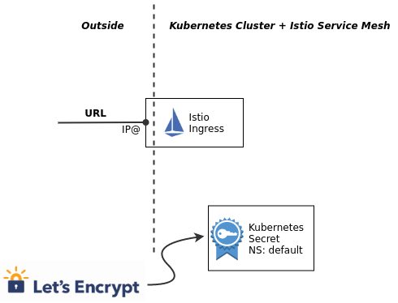

# Expose the Istio Ingress gateway via DNS with TLS enabled

In the previous exercise we created a [DNS](https://en.wikipedia.org/wiki/Domain_Name_System) entry for the [Ingress controller](https://kubernetes.io/docs/concepts/services-networking/ingress/). 

In this exercise we enable secure HTTPS access via the Istio Ingress gateway on port 443. The procedure we will use in this exercise is documented in the IBM Cloud documentation [here](https://cloud.ibm.com/docs/containers?topic=containers-istio-mesh#istio_expose_bookinfo_tls). There is also generic documentation about [Secure Gateways](https://istio.io/latest/docs/tasks/traffic-management/ingress/secure-ingress/) available in the Istio documentation.

The Istio Ingress gateway on the IBM Cloud is of type LoadBalancer and in the last exercise we created a DNS entry for it. In the background this also automatically generates a "Let's encrypt" certificate and private key for HTTPS/TLS traffic and it creates a Kubernetes secret of type 'tls' containing this certificate and key. 



The secret is created in the 'default' namespace. The Istio Ingress pod is running in the 'istio-system' namespace. The following info is from the Kubernetes documentation: *Secret resources reside in a namespace. Secrets can only be referenced by Pods in that same namespace.*
Therefore we need to pull certificate and key from the secret in the 'default' namespace, change its name, and create a new secret in the 'istio-system' namespace so that the Istio Ingress gateway can use it.


### Step 1: List the DNS subdomains

```sh
cd $ROOT_FOLDER/IKS
ibmcloud ks nlb-dns ls --cluster $MYCLUSTER
```

Example output:

```sh
Hostname                                                                                            IP(s)                       Health Monitor   SSL Cert Status   SSL Cert Secret Name                                            Secret Namespace   
harald-uebele-k8s-fra05-********************-0000.us-south.containers.appdomain.cloud   169.46.52.50,169.48.97.58   enabled          created           harald-uebele-k8s-fra05-********************-0000   default   
harald-uebele-k8s-fra05-********************-0001.us-south.containers.appdomain.cloud   169.48.97.62                None             created           harald-uebele-k8s-fra05-********************-0001   default
```

### Step 2: Save Ingress secret

You should see 2 entries, the first is for the Kubernetes Ingress that is created for you when the cluster is created. The second is the Istio Ingress subdomain you created in the last exercise. 

Copy the "SSL Cert Secret Name" (should end on -0001) and paste it into another environment variable:

```sh
export INGRESSSECRET=harald-uebele-k8s-fra05-********************-0001
```

### Step 3: Pull the secret and save it into a file 'mysecret.yaml'

```sh
kubectl get secret $INGRESSSECRET --namespace default --export -o yaml > mysecret.yaml
```

### Step 4: Edit the 'mysecret.yaml'

The secret was created in the 'default' namespace. In order to use it with Istio, we want to modify the name and place it in the 'istio-system' namespace.

Open the mysecret.yaml file in an editor, e.g. `nano`, change the value of the secret name from something like `name: harald-uebele-k8s-fra05-******-0001` to `name: istio-ingressgateway-certs` and save the file.

```sh
nano mysecret.yaml
```

Your changed file should look similar to this example, the changed line is line 12:

```yml
apiVersion: v1
data:
  tls.crt: LS0tLS1CRUdJTiBDRVJUSUZJQ0FURS0tLS0tCk...
  tls.key: LS0tLS1CRUdJTiBSU0EgUFJJVkFURSBLRVktLS...
kind: Secret
metadata:
  annotations:
    ingress.cloud.ibm.com/cert-source: ibm
    kubectl.kubernetes.io/last-applied-configuration: |
      {"apiVersion":"v1","data":{"tls.crt":"LS0tLS1CRUdJTiBDRVJUSUZJQ0FU...
  creationTimestamp: null
  name: istio-ingressgateway-certs
  selfLink: /api/v1/namespaces/default/secrets/harald-uebele-k8s-***************-0001
type: Opaque
```

### Step 5: Load and activate the secret with these commands

Here the second command deletes the Istio Ingress pod to force it to reload and use the the newly created secret.

```sh
kubectl apply -f ./mysecret.yaml -n istio-system
kubectl delete pod -n istio-system -l istio=ingressgateway
```

### Step 6: Get the `$INGRESSURL` you obtained in the last exercise and copy or note the value.

```sh
echo $INGRESSURL
```

### Step 7: Edit the file `istio-ingress-tls.yaml`

Edit the file istio-ingress-tls.yaml: 

```sh
nano istio-ingress-tls.yaml
```

Replace the 2 occurances of wildcard "*", one in the Gateway definition, one in the VirtualService definition and save the file. 
Watch out for the correct indents, this is YAML!

```yml
...
 servers:
  - port:
      number: 443
      name: https
      protocol: HTTPS
    tls:
      mode: SIMPLE
      serverCertificate: /etc/istio/ingressgateway-certs/tls.crt
      privateKey: /etc/istio/ingressgateway-certs/tls.key
    hosts: "*"
...
apiVersion: networking.istio.io/v1alpha3kind: VirtualService
metadata:  name: virtualservice-ingress
spec:
  hosts:
  - "*"
  gateways:
...
```

This creates 2 Istio objects: Gateway and VirtualService, both in the `default` namespace. The Gateway definition basically allows to direct requests via HTTPS to services in the `default` namespace. 


The VirtualService definition for this Gateway uses matching rules to map specific paths/URIs to services that do not exist at the moment, we will create them later. If you look in the YAML file, you can see 3 "match" rules, they are all based on the "hosts" definition which is the Ingress URL:
* "https://INGRESSURL/auth" routes to the Keycloak service on port 8080
* "https://INGRESSURL/articles" routes to the Web-API service on port 8081
* "https://INGRESSURL", the root ('/') without a path, routes to the Web-App on port 80, this is the service that delivers the frontend app to the browser


### Step 8: Apply the change

This last step, replacing the wildcard host "*" with the correct DNS name, is not really necessary. The Ingress Gateway would work with the wildcard, too, but now you have a correct configuration that is more secure. And this is what this workshop is about, isn't it?

`istio-ingress-tls.yaml` creates an Istio Gateway configuration using the TLS certificate we stored in a Kubernetes secret before. 


```sh
kubectl apply -f istio-ingress-tls.yaml
```

_Note:_ There is a blog on the Istio page that describes how to [Direct encrypted traffic from IBM Cloud Kubernetes Service Ingress to Istio Ingress Gateway](https://istio.io/latest/blog/2020/alb-ingress-gateway-iks/). With this scenario you can have non-Istio secured services communicate with services secured by Istio, e.g. while you are migrating your application into Istio.

This blog also contains an important piece of information regarding the Let's Encrypt certificates used:

> The certificates provided by IKS expire every 90 days and are automatically renewed by IKS 37 days before they expire. You will have to recreate the secrets by rerunning the instructions of this section every time the secrets provided by IKS are updated. You may want to use scripts or operators to automate this and keep the secrets in sync.

---

### Answering questions you maybe have

Here are some questions you may have regarding TLS (HTTPS):

---
#### **Question 1**: Why can we access our application with TLS (https://...) ?
#### **Answer:** We prepared this during the setup of the IBM Cloud Application Environment in exercise 3.

> * We let IBM Cloud create a DNS entry and Let's Encrypt certificate
> * We added this certificate to the Istio Ingress
> * We added the DNS name (host) to the Istio Ingress Gateway definition
> * We added it also to the VirtualService definition that configures the Gateway and here is our secret, look at [IKS/istio-ingress-tls.yaml](https://cloud-native-starter/blob/master/security/IKS/istio-ingress-tls.yaml):
>
>   The Gateway definition specifies HTTPS only and points to the location of the TLS certificates.
>    The VirtualService definition specifies 3 rules:
>    * If call the DNS entry / Ingress URL with '/auth' it will direct to keycloak.
>   * With '/articles' it will direct to the web-api
>   * Without an path it directs to the web-app itself.

---

#### **Question 2:** We use https in the browser but everything behind the Istio Ingress is http only, unencrypted?
#### **Answer:** 

> That is the beauty of Istio! Yes, we make our requests via http which is most obvious with the web-app that is called on port 80.
>
> But Istio injects an Envy proxy into every pod in the default namespace automatically. We defined this when we set up Istio, it is in the script you ran.
>
> There is also an Envoy proxy in the Istio Ingress pod. Communication between the Envoys is always encrypted, Istio uses mTLS. And all our requests flow through the proxies so even if the communication between e.g. web-api and articles is using http, the communication between the web-api pod and the articles pod is secure.

---

#### **Question 3:** Is this safe?
#### **Answer:** 

> No, at least not not totally. By default, after installation, Istio uses mTLS in PERMISSIVE mode. This allows to test and gradually secure your microservices mesh.

> In the later exercise `Secure microservices with strict mTLS` you will see how to change that.

