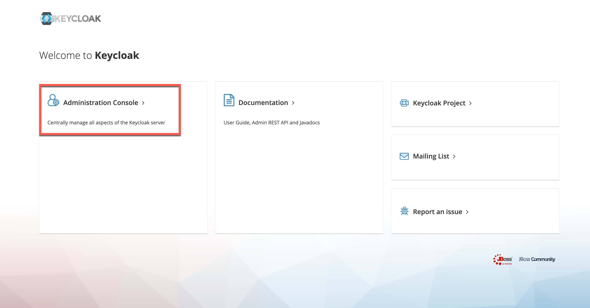
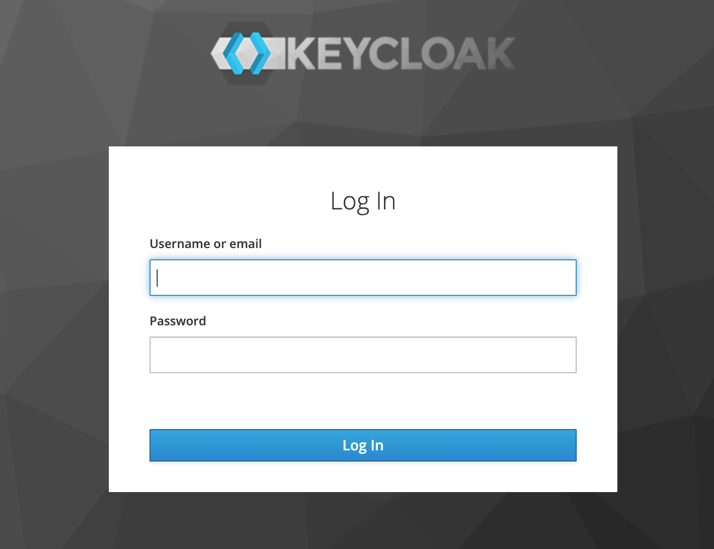
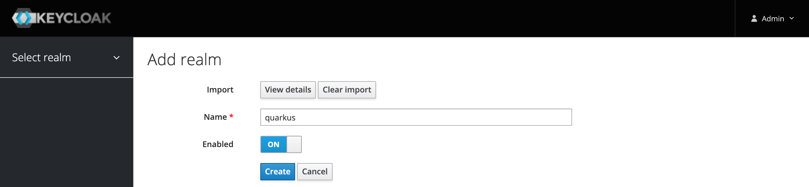
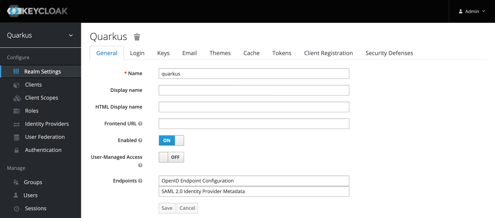

# Setup Keycloak

These setup instractions are based on [Keycloak - Guide - Keycloak on Kubernetes](https://www.keycloak.org/getting-started/getting-started-kube).

The instructions go into installing an Ingress for Keycloak. But we have Istio installed and we will be using the Istio Ingress to access Keycloak externally. The original `keycloak.yaml` is modified and the `NodePort` has been removed. 

Note: This is a "ephemeral" installation of Keycloak, there is no database used for persistance. Sufficient for a workshop but not suitable for production use!

### Step 1: Deploy Keycloak

```sh
kubectl apply -f keycloak.yaml
```

### Step 2: Wait until the Keycloak Pod is started

```sh
kubectl get pods
```

### Step 3: Access Keycloak

Get the Keycloak URL and open the URL in your browser:

```sh
echo "https://"$INGRESSURL"/auth"
```

Note: This will work because we created a VirtualService in the previous exercise that maps the '/auth' URI to the Keycloak service.

### Step 4: Try to logon to Keycloak

* Click on 'Administration Console'. 



* Login In with username 'admin' and password 'admin'.



### Step 5: Create realm

For the workshop we need our pre-configured realm, we will create the realm using a bash script. 

* Verify your existing environment varibles

```sh
cd $ROOT_FOLDER/IKS  
echo $MYCLUSTER 
echo $INGRESSURL
echo $INGRESSSECRET
```

* Execute the bash script

```sh
bash keycloak-create-realm.sh
```
Example output:

```sh
------------------------------------------------------------------------
The realm is created.
Open following link in your browser:
https://harald-uebele-k8s-fra05-********************-0001/auth/admin/master/console/#/realms/quarkus
------------------------------------------------------------------------
```
### Step 6: Verify the newly created realm

Try to create an access token, this requires the $INGRESSURL environment variable to be set:

```sh
curl -d "username=alice" -d "password=alice" -d "grant_type=password" -d "client_id=frontend" https://$INGRESSURL/auth/realms/quarkus/protocol/openid-connect/token  | sed -n 's|.*"access_token":"\([^"]*\)".*|\1|p'
```

### (Optional) STEP 7: Verify the name `quarkus`of the imported realm



### (Optional) STEP 8: Verify the imported realm settings



### (Optional) STEP 9: Press `view all users`

You should see following users: `admin`, `alice`, `jdoe`


### (Optional) STEP 10: Verify the role mapping


