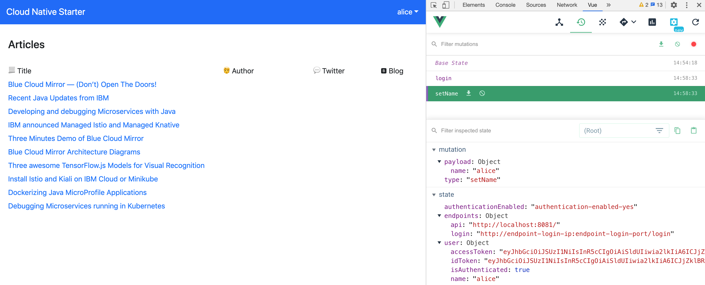

# Authentication in the Vue.js fronted

There are several ways to use Keycloak from web applications. The easiest option is to use the official Keycloak JavaScript client library which is defined as dependency in package.json.

The Vue.js application triggers the authentication directly when the application is opened. See the file main.js:

```javascript
import Keycloak from 'keycloak-js';
 
let initOptions = {
  url: 'https://keycloak-default.niklas-heidloff-b3c-4x16-162e406f043e20da9b0ef0731954a894-0000.us-south.containers.appdomain.cloud/auth', 
    realm: 'quarkus', clientId: 'frontend', onLoad: 'login-required'
}
 
Vue.config.productionTip = false
Vue.config.devtools = true
Vue.use(BootstrapVue);
 
let keycloak = Keycloak(initOptions);
keycloak.init({ onLoad: initOptions.onLoad }).then((auth) => {
  if (!auth) {
    window.location.reload();
  }
 
  new Vue({
    store,
    router,
    render: h => h(App)
  }).$mount('#app')
 
  let payload = {
    idToken: keycloak.idToken,
    accessToken: keycloak.token
  }
  if (keycloak.token && keycloak.idToken && keycloak.token != '' && keycloak.idToken != '') {
    store.commit("login", payload);
    console.log("User has logged in: " + keycloak.subject)
  }
  else {
    store.commit("logout");
  }
```

In order to use the Keycloak API, three pieces of information are required. The `Keycloak URL`, the `realm` and the `client id`.

As you see in the image below  the `Vuex store` saves `access token`, `id token` and `user name`. When the tokens expire, new tokens are requested via the refresh token und the Vuex store is updated.



---

[Related blog post](http://heidloff.net/article/securing-vue-js-applications-keycloak/)
