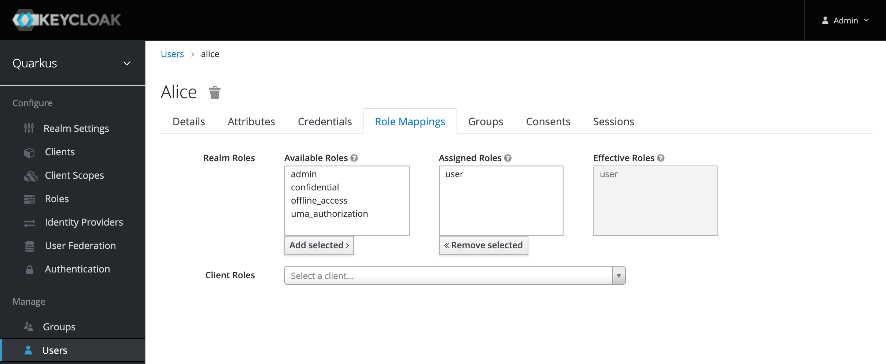

# Authorization in Quarkus application

Quarkus comes with two great quides that describe how to use Keycloak in web apps and services:

* [Use OpenID Connect to Protect Service Applications](https://quarkus.io/guides/security-openid-connect)
* [Use OpenID Connect to Protect Web Applications](https://quarkus.io/guides/security-openid-connect-web-authentication)
* Develop protected Endpoints

The Microservice Articles provides an endpoint `/articles` which only users with the role `user` can access. In application.properties the Keycloak URL is defined as well as the client ID and secret.

### Developing protected Endpoints

The service Articles provides an endpoint ‘/articles’ which only users with the role ‘user’ can access. In application.properties the Keycloak URL is defined as well as the client ID and secret.

```Java
quarkus.oidc.auth-server-url=https://YOUR_URL/auth/realms/quarkus

quarkus.oidc.client-id=backend-service
quarkus.oidc.credentials.secret=secret
quarkus.http.port=8082
quarkus.http.cors=true
resteasy.role.based.security=true
```

Note the line `resteasy.role.based.security=true`. This setting is important, so that the Articles service can receive the Authorization header from the Web-API service. I couldn’t find this in the Quarkus documentation, but Phillip Krüger from the Quarkus team provided this information.

Once you’ve configured your Quarkus application, implementing the endpoint is trivial. Here we use `@RolesAllowed`, but there are other annotations available, for example `@Authenticated`.

```Java
@GET
@Path("/articles")
@Produces(MediaType.APPLICATION_JSON)
@RolesAllowed("user")
@NoCache
public Set<Article> getArticles() {  
   return articles;
}
```

This allows the test user Alice to invoke this endpoint, since she has the role `user.



### Invoking protected Endpoints

The Web-API service has also a protected endpoint which has been implemented as above. Additionally it also invokes the Articles service. In order to do this, the MicroProfile REST Client is used.

Let’s take at the configuration first.

```Java
quarkus.oidc.auth-server-url=https://keycloak-default.niklas-heidloff-b3c-4x16-162e406f043e20da9b0ef0731954a894-0000.us-south.containers.appdomain.cloud/auth/realms/quarkus
quarkus.oidc.client-id=backend-service
quarkus.oidc.credentials.secret=secret
quarkus.http.port=8081
quarkus.http.cors=true
org.eclipse.microprofile.rest.client.propagateHeaders=Authorization
```

The last line (6) is important again. This allows forwarding the authorization header with the JWT token without having to implement any code.

```Java
private ArticlesService articlesService;
 
@PostConstruct
void initialize() {
   URI apiV1 = UriBuilder.fromUri("http://{host}:{port}/articles").build(articlesHost, articlesPort);     
   articlesService = RestClientBuilder.newBuilder()
      .baseUri(apiV1)
      .register(ExceptionMapperArticles.class)
      .build(ArticlesService.class);        
}
 
public List<CoreArticle> getArticles(int amount) throws NoConnectivity {
   try {
      return articlesService.getArticlesFromService(amount);
   } catch (Exception e) {
      throw new NoConnectivity(e);
   }
}
```

---

[Related blog post](http://heidloff.net/article/security-quarkus-applications-keycloak)