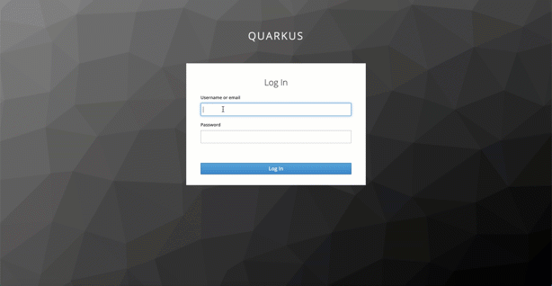

# Setup the web-application and Microservices locally

To run these optional exercises you need to ensure you have installed the following tools on your local machine and you can run them in your terminal sessions.

* [git 2.24.1 or higher](https://git-scm.com/book/en/v2/Getting-Started-Installing-Git)
* [yarn 1.22.4 or higher](https://yarnpkg.com)
* [Node.js v14.6.0 or higher](https://nodejs.org/en/)
* [Apache Maven 3.6.3](https://maven.apache.org/ref/3.6.3/maven-embedder/cli.html)
* Java 9 or higher

### Architecture 

Here is the local architecture whichs shows the Web-App and the two Microservices Web-API and Articles are running on your local machine in terminal sessions. Keycloak is running on Kubernetes on IBM Cloud.


The gif shows the logon to the example application with Keycloak.



### Step 1: Clone the project to your local machine

```sh
git clone https://github.com/IBM/cloud-native-starter.git
cd cloud-native-starter/security
ROOT_FOLDER=$(pwd) 
```

### (Optional) Setup Keycloak locally

If you have your Keycloak running on Kubernetes you just skip to [setup Web-App](app-sec-exercise-01#step-1-configure-web-app). 

In this part we will setup Keycloak locally. We will run a local Keycloak Docker container and reuse an existing realm configuration.

The image below shows the relevant elements we will use later.


---

#### Step 1: Start Keycloak Docker image local

Open the first terminal session and enter:

```sh
$ docker run -it -e KEYCLOAK_USER=admin -e KEYCLOAK_PASSWORD=admin -p 8282:8080 jboss/keycloak:9.0.2
```
#### Step 2: Import the existing realm configuration

1. Open the Keycloak in a browser select the Administration Console

Use following URL:

```sh
http://localhost:8282/
```


2. Login to using the URL in your browser with `user/admin` and `password/admin`

3. Select _Add realm_


3. Choose for import _Select file_ and open the `quarkus-realm.json`.


#### Step 3: Press `view all users`

You should see following users: `admin`, `alice`, `jdoe`


#### Step 4: Verify the role mapping


### Setup Web-App

#### Step 1: Configure web-app

Now insert `Keycloak URL`/auth in `main.js`.

```sh
cd $ROOT_FOLDER/web-app/src
nano main.js
```

Example:

```JavaScript
if (currentHostname.indexOf('localhost') > -1) {
  urls = {
    api: 'http://localhost:8081/',
    login: 'https://YOUR_URL/auth' // insert your http or https://<KeycloakURL>/auth
  }
  store.commit("setAPIAndLogin", urls);
}
```

#### Step 2: Run the web-app 

Open the second terminal session and start the application on port 8080.

```sh
cd $ROOT_FOLDER/web-app
yarn install
yarn serve
```

### Setup Web-Api

#### Step 1: Configure web-api-secure

Insert your the `auth-server-url` URL of your Keycloak instance in `application.properties` file and save the file.

Therefore you use the `Keycloak URL` you got during the setup of Keycloak on IBM Cloud.

```sh
cd $ROOT_FOLDER/web-api-secure/src/main/resources
nano application.properties
```

Example:

```Java
// When running locally, uncomment the next line, add your Keycloak URL, must end on '/auth/realms/quarkus'
quarkus.oidc.auth-server-url=https://YOUR_URL/auth/realms/quarkus

quarkus.oidc.client-id=backend-service
quarkus.oidc.credentials.secret=secret

quarkus.http.port=8081
quarkus.http.cors=true

resteasy.role.based.security=true
```

#### Step 2: Run the web-api-secure Microservice 

Open a third terminal and start the service on port 8081.

```sh
cd $ROOT_FOLDER/web-api-secure
mvn clean package quarkus:dev
```

### Setup Articles microservice

#### Step 1: Configure articles-secure

Insert your the `auth-server-url` URL of your Keycloak instance in `application.properties` file and save the file.
Therefore you use the `Keycloak URL` you got during the setup of Keycloak on IBM Cloud. 

```sh
cd $ROOT_FOLDER/articles-secure/src/main/resources
nano application.properties
```

Example:

```Java
// When running locally, uncomment the next line, add your Keycloak URL, must end on '/auth/realms/quarkus'
quarkus.oidc.auth-server-url=https://YOUR_URL/auth/realms/quarkus

quarkus.oidc.client-id=backend-service
quarkus.oidc.credentials.secret=secret

quarkus.http.port=8082
quarkus.http.cors=true

resteasy.role.based.security=true
```

#### Step 2: Run the articles-secure Microservice 

Open a fourth terminal and start the service on port 8081.

```sh
cd $ROOT_FOLDER/articles-secure
mvn clean package quarkus:dev
```

### Open the Web-App

#### Step 1: Open the Web-App in your local browser

Open the following URL in your browser:

```sh
http://localhost:8080
```

#### Step 2: Log in with the test user: alice, password: alice