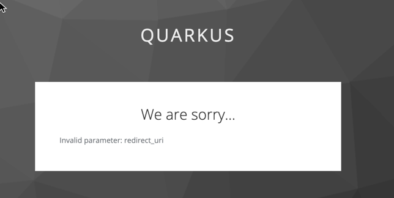
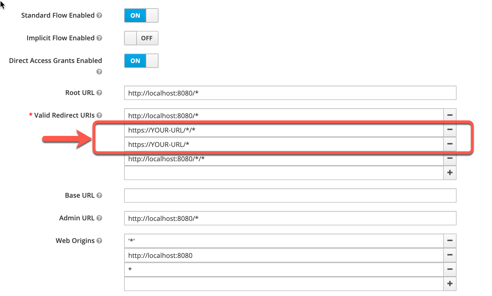
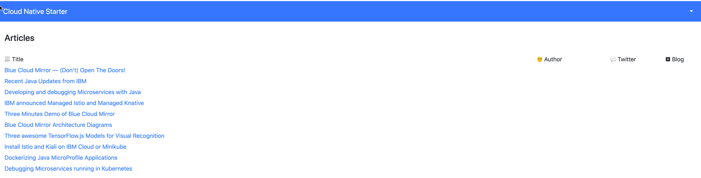

# Deploy microservices to Kubernetes

In a later exercise you will run the application locally.

In this exercise we will run the application in your Kubernetes cluster using precompiled container images for our sample application: articles-secure, web-api-secure, and web-app. These container images have been uploaded to [Docker Hub](https://hub.docker.com/u/haraldu).

When running locally, you will set the Keycloak URL as OpenID Connect (OIDC) provider in application.properties. When running on a Kubernetes cluster we cannot set the OIDC provider (keycloak) in application.properties without recompiling the code, building a new image, and loading this image in a Image repository that is accessible to your Kubernetes cluster. So for this example, we specify the Quarkus OIDC property as environment variable during deployment. The environment variable is read from a config map. 

### STEP 1: Change `configmap.yaml` entry

In directory IKS, modifify configmap.yaml and edit `QUARKUS_OIDC_AUTH_SERVER_URL` with your keycloak URL. It must end in `/auth/realms/quarkus, enclosed in "".

* Create the `QUARKUS_OIDC_AUTH_SERVER_URL` and copy the URL to insert it in the next step in the `configmap.yaml`

```sh
cd $ROOT_FOLDER/IKS
export QUARKUS_OIDC_AUTH_SERVER_URL="https://$INGRESSURL/auth/realms/quarkus"
echo $QUARKUS_OIDC_AUTH_SERVER_URL
```

* Replace the URL in the `configmap.yaml`

```sh
nano configmap.yaml
```

Example:

```sh
kind: ConfigMap
apiVersion: v1
metadata:
  name: security-url-config
data:
  QUARKUS_OIDC_AUTH_SERVER_URL: "https://harald-uebele-*****-0001.containers.appdomain.cloud/auth/realms/quarkus"
```

* Apply the `configmap.yaml`

```sh
kubectl apply -f configmap.yaml
```

### STEP 2: Now deploy the 3 services:

* Deploy Articles Microservice

```sh
cd $ROOT_FOLDER/articles-secure/deployment
kubectl apply -f articles.yaml
```

* Deploy Web-API Microservice

```sh
cd $ROOT_FOLDER/web-api-secure/deployment
kubectl apply -f web-api.yaml
```

* Deploy Web-App [Vue.js](https://vuejs.org/) frontend application

```sh
cd $ROOT_FOLDER/web-app/deployment
kubectl apply -f web-app.yaml
```

* Verify all pods are running

```sh
kubectl get pods
```

Example output:

```sh
NAME                        READY   STATUS                       RESTARTS   AGE
articles-5df77c46b4-v7xcd   2/2     Running                0          3h35m
keycloak-77cffb978-vjttk    2/2     Running                      0          44h
web-api-5c9698b875-kz82k    2/2     Running                 0          3h35m
web-app-659c4676d9-pw6f8    2/2     Running                      0          3h34m
```

### STEP 3: Adjust the redirect, admin, web origins URLs in Keycloak:

* Try to open the Cloud-Native-Starter application in a browser. Use the `$INGRESSURL` of your cluster, which is the URL to the frontend application `Web_APP` you deployed before.

```sh
echo https://$INGRESSURL
```

* You will see we need to configure the redirect in Keycloak




* Open Keycloak in a browser and login to Keycloak with `user: admin` and `password: admin`. Get the right URL by display the URL with the following terminal command.

```sh
 echo https://$INGRESSURL/auth/admin/master/console/#/realms/quarkus
```

* Select `Clients` and then `frontend` in Keycloak.


* Ajust the client frontend URIs `https://YOUR-URL:auth` with valid redirect URI you get with the command:

```sh
 echo https://$INGRESSURL
```

Replace the entries with your value.



### STEP 4: Open the Cloud Native Starter application in your browser

* Use following URL:

```sh
 echo https://$INGRESSURL
```

* Login in with `user: alice` and `password: alice`


* Now you see the entries of the articles

