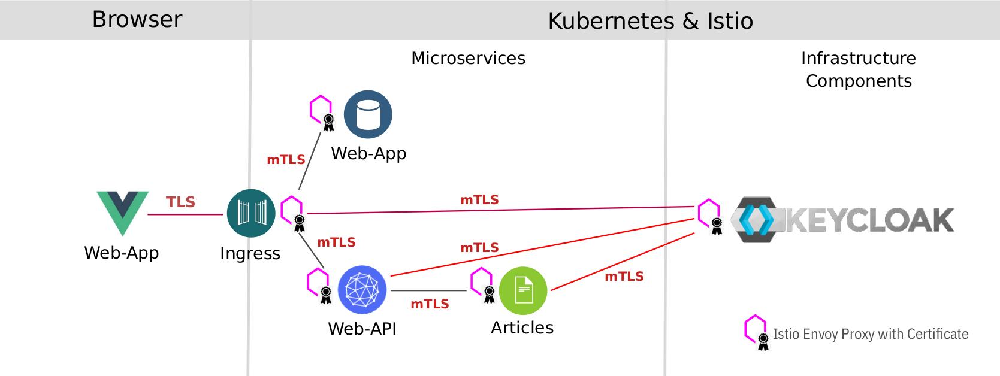

# Secure microservices with strict mTLS

Istio uses *Mutual authentication with Transport Layer Security (mTLS)* to secure the communication between microservices without requiring application code changes. Security is provided by authenticating and encrypting communication paths within the cluster. This is becoming a common security and compliance requirement. Delegating communication security to Istio (as opposed to implementing TLS in each microservice) ensures that your application will be deployed with consistent and manageable security policies.

This exercise will cover only a part of the Istio security features. The Istio documentation has a lot more information.

Istio provides each Envoy sidecar proxy with a strong (cryptographic) identity, in the form of a certificate. This identity is based on the microservice's service account and is independent of its specific network location, such as cluster or current IP address. This is called Secure naming. Envoys then use the certificates to identify each other and establish an authenticated and encrypted communication channel between them.

Istio is responsible for:

* Providing each service with an identity representing its role.
* Providing a common trust root to allow Envoys to validate and authenticate each other.
* Providing a key management system, automating generation, distribution, and rotation of certificates and keys.

When an application microservice connects to another microservice, the communication is redirected through the client side and server side Envoys. The end-to-end communication path is:

* Local TCP connection (i.e., localhost, not reaching the "wire") between the application and Envoy (client- and server-side);

* Mutually authenticated and encrypted connection between Envoy proxies.

This includes the Istio Ingress for incoming and the Istio Egress for outgoing connections. Your Kubernetes cluster may/will have its own ingress but this ingress is not paired with an Envoy sidecar and therefore is not able to directly participate in secure and encrypted communications.

mTLS is enabled by default for the communication between Envoys **but it is enabled in permissive mode**. This means that a microservice outside of the Istio Service Mesh, one without a Envoy proxy, can communicate with a microservice within the Service Mesh. This allows you to bring your microservices into the Service Mesh and then gradually turn on and test security. 

### TASK 1: Test permissive mode

In this task we access the Web-API service using the services nodeport, the IP address of a worker node, and unencrypted HTTP, effectively bypassing the Istio Ingress This is only possible because Istio is still using mTLS in permissive mode. 

### Step 1: Create a access-token

We need a JSON Web Token (JWT) to access the service:

```sh
export access_token=$(curl -d "username=alice" -d "password=alice" -d "grant_type=password" -d "client_id=frontend" https://$INGRESSURL/auth/realms/quarkus/protocol/openid-connect/token  | sed -n 's|.*"access_token":"\([^"]*\)".*|\1|p')
echo $access_token
```

_Note:_ REMEMBER that an access-token is only valid for 60 seconds ;-). You need to be quick with the next steps otherwise the token will already be involid!

### Step 2: Get the NodePort of the Web-API Microservice

```sh
export nodeport=$(kubectl get svc web-api --ignore-not-found --output 'jsonpath={.spec.ports[*].nodePort}')
echo $nodeport
```

### Step 3: Get a external Worker IP address of the Web-API Microservice

```sh
export workerip=$(ibmcloud ks workers --cluster $MYCLUSTER | awk '/Ready/ {print $2;exit;}')
echo $workerip
```

We now have an external IP address and port to access the Web-API service.

### Step 4: Use no TLS just `HTTP` to get the articles from the Web-API Microservice


```sh
curl -i http://$workerip:$nodeport/articles -H "Authorization: Bearer $access_token"
```

Example output:

```sh
HTTP/1.1 200 OK
cache-control: no-cache
content-length: 1663
content-type: application/json
x-envoy-upstream-service-time: 60
x-envoy-peer-metadata: CjgKDElOU1RBTkNF*****kaB3dlYi1hcGk=
x-envoy-peer-metadata-id: sidecar~172.30.83.82~web-api-5c9698b875-sn9ck.default~default.svc.cluster.local
date: Wed, 05 Aug 2020 14:15:57 GMT
server: istio-envoy
x-envoy-decorator-operation: web-api.default.svc.cluster.local:8081/*

[{"authorBlog":"","authorTwitter":"","title":"Blue Cloud Mirror — (Don’t) Open The Doors!","url":"https://haralduebele.blog/2019/02/17/blue-cloud-mirror-dont-open-the-doors/"},{"authorBlog":"","authorTwitter":"","title":"Recent Java Updates from IBM","url":"http://heidloff.net/article/recent-java-updates-from-ibm"},******* "title":"Three awesome TensorFlow.js Models for Visual Recognition","url":"http://heidloff.net/article/tensorflowjs-visual-recognition"},{"authorBlog":"","authorTwitter":""]
```
As result of the last command you can see an HTTP status of 200 which means OK and the correct result, a list of blog articles as a JSON object. 

This is not totally unsecure since we needed an access token (JWT) to make the REST call but we were able to access the service using http only on port 80. Somebody with access to the cluster and the required skills could stage a man-in-the-middle attack and read the data because it is not encrypted.

We are going to change this in the next step.


### TASK 2: Set mTLS to strict in default namespace and for services

By switching mTLS to strict mode it is impossible for external traffic to bypass the Istio Ingress. External traffic means external to the Kubernetes cluster (coming from the outside) or external to the default namespace, i.e. not being part of the servie mesh.

This is the reason why we installed Keycloak into the default namespace: that way it is part of our service mesh and included in the mTLS "dance" automatically. In a real world example you would most likely use a different approach.

### Step 1: The following command creates a PeerAuthentication policy for the 'default' namespace and DestinationRules for Web-API and Articles.

```sh
cd $ROOT_FOLDER/IKS
kubectl apply -f mtls.yaml
```

This enforces mTLS in the 'default' namespace and to access the Web-API and Articles services.

### Step 2: Create a new access-token and invoke the Web-API Microservice with `HTTP` again

As you will see, you can no longer access the service, even if you know its NodePort and the external IP of a Kubernetess worker node.

* Create access-token

   ```sh
    export access_token=$(curl -d "username=alice" -d "password=alice" -d "grant_type=password" -d "client_id=frontend" https://$INGRESSURL/auth/realms/quarkus/protocol/openid-connect/token  | sed -n 's|.*"access_token":"\([^"]*\)".*|\1|p')
    echo $access_token
   ```

* Invoke Web-API Microservice

   ```sh
   curl -i http://$workerip:$nodeport/articles -H "Authorization: Bearer $access_token"
   ```

   Example output:

   ```sh
   curl: (56) Recv failure: Connection reset by peer
   ```

Now everything is secure. 

If you check the Cloud Native Starter frontend in the browser, nothing should have changed because it already used enrypted paths:
* Access to the Web-App is through the Istio Ingress gateway using https (loading the JavaScript/Vue.js code into the browser)
* The (external) Web-App is accessing the Keycloak server and the Web-API service using https
   * Those requests come in through the Istio Ingress gateway
   * Since the Istio Ingress gateway, Keycloak, and Web-API are all part of the service mesh, communication between them is already encrypted using mTLS
* REST API calls from Web-API to Articles use mTLS   
* Access from outside into the applications/services running in the 'default' namespace is prohibited now by enforcing strict mTLS. You can only access the services through the Istio Ingress.  

This is the result of your work so far:

