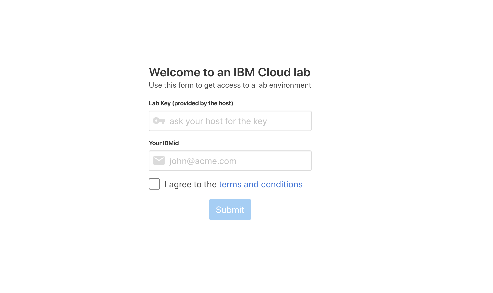
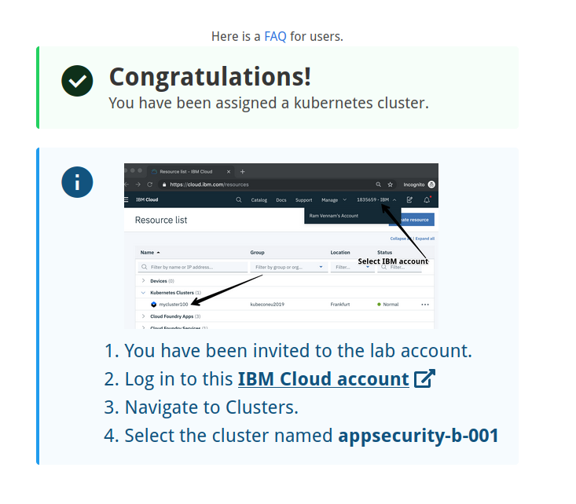
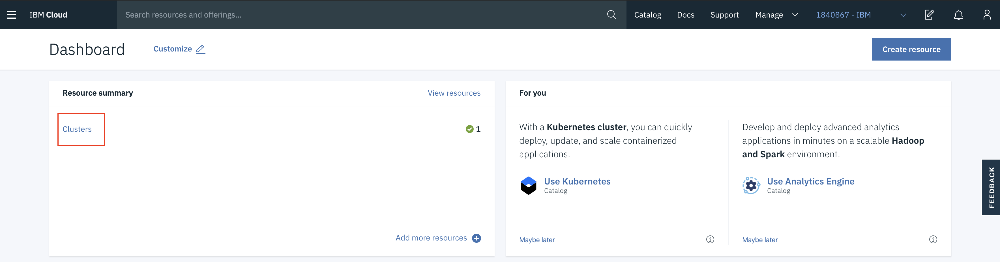
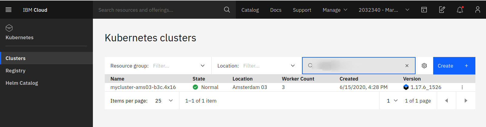
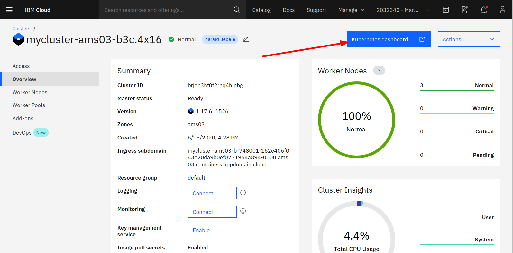

# Access the Cluster

In this section you will login to your own IBM Cloud account and then get access to an IBM Cloud Lab account which contains pre-provisioned clusters. Each workshop attendee will be granted access to one pre-provisioned cluster.

### Step 1: Setting up your IBM Cloud ID

* Log into IBM Cloud with an existing account: <https://cloud.ibm.com>

OR

* Create your own: [http://ibm.biz/nheidloff](https://ibm.biz/Bdfs5U)

### Step 2: Accessing the Cluster

Instructors will provide a URL to a web app. Enter your IBMid (the email you used to sign up) and the workshop key (also provided by the [instructor link](https://thomassuedbroecker.github.io/labinstructions/)).

* Follow the instructions on the next page. You will be added to the IBM Workshop account and granted access to a cluster. Note the name of your cluster. In the example below, it's `TorontoMulticlientWorkshop31`.

* Back in IBM Cloud, refresh the [IBM Cloud Dashboard](https://cloud.ibm.com). If required, switch to the **1840867-IBM** account by clicking on the account selection drop down in the top nav bar.

* Click on **Clusters** in the **Resource Summary** tile.

* Under **Clusters**, click on the cluster that has been assigned to you.

* Launch the **Kubernetes Dashboard** and have a look around! You can come back to this dashboard throughout your workshop.

* Go back to the open browser tab the open Kubernetes Cluster in the IBM Cloud web console. Now select `Access` on the left-hand side, here you see all steps to access your Kubernetes Cluster in a terminal session. You can easily copy and paste the commands. We will use these commands later to access the Kubernetes cluster in the IBM Cloud Shell.

