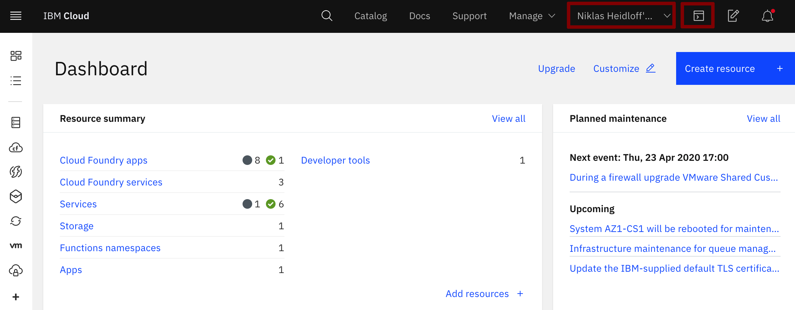
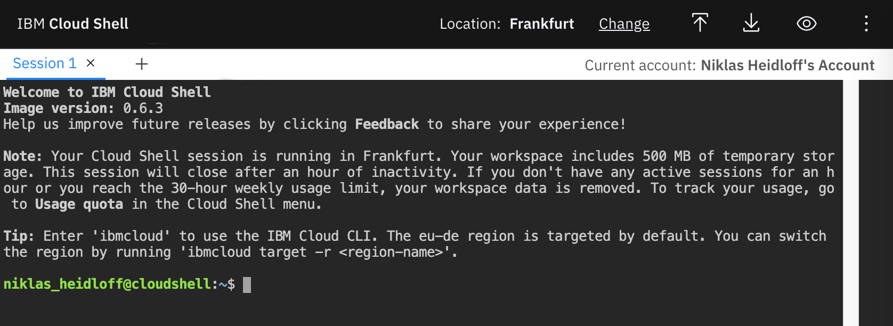
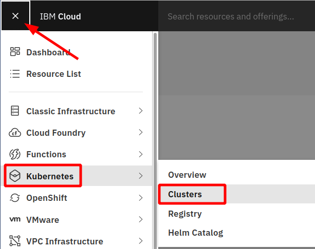
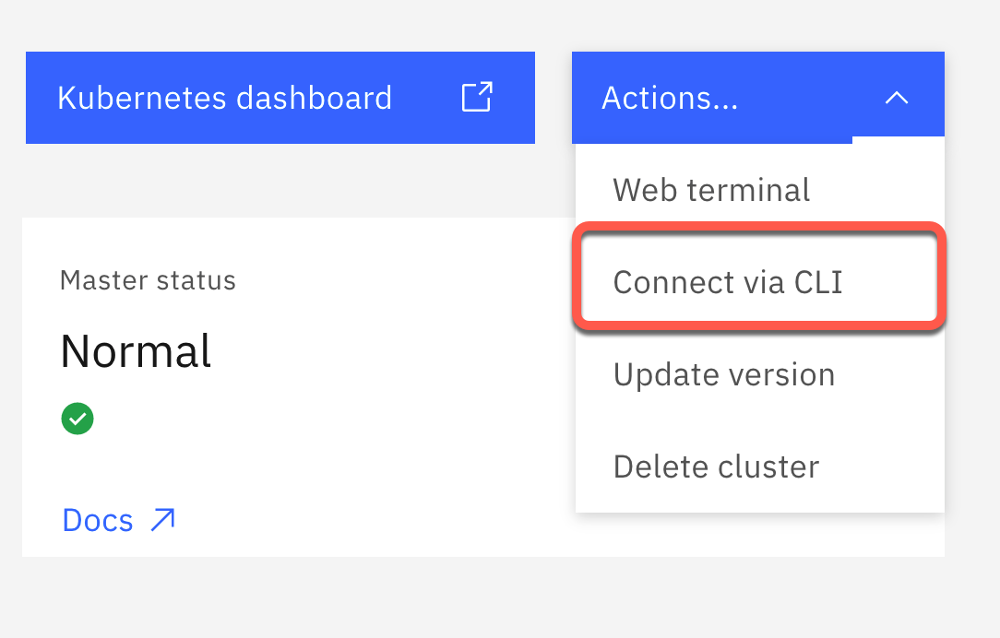
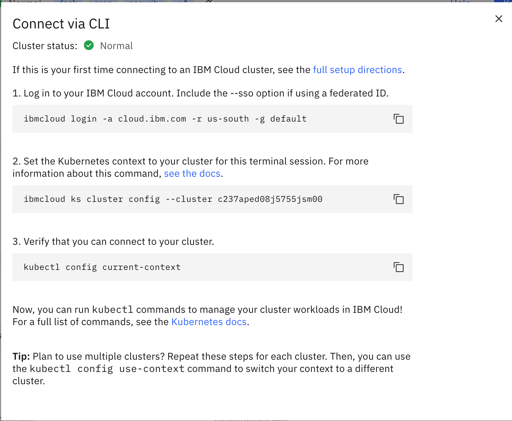

# IBM Cloud Shell

For this workshop we'll be using the IBM Cloud Shell as work environment. The IBM Cloud Shell is a cloud-based shell that you can access through your browser. It is preconfigured with the full IBM Cloud CLI and other 3rd party CLIs like OpenShift's `oc`, Helm's `helm`, Kubernetes' `kubectl`, etc. You can find the list of installed plug-ins [here](https://cloud.ibm.com/docs/cloud-shell?topic=cloud-shell-plugins-tools).

### Step 1: Setup the IBM Cloud Shell terminal session

When using the IBM Cloud Shell, no client side setup is required for this workshop, it comes with all necessary CLIs (command line tools).

In your browser, login to the [IBM Cloud](https://cloud.ibm.com) Dashboard. **Make sure you select your own account** in the account list at the top, then click on the IBM Cloud Shell icon.

This opens a new browser tab with your IBM Cloud Shell session.



Note: Your workspace includes 500 MB of temporary storage. This session will close after an hour of inactivity. If you don't have any active sessions for an hour or you reach the 50-hour weekly usage limit, your workspace data is removed.

You should see you personal ID as `Current account: [User]'s Account'`:



If you want to perform this workshop locally on your own workstation, you need a local terminal and the following tools:

* [git](https://git-scm.com/book/en/v2/Getting-Started-Installing-Git)
* [curl](https://curl.haxx.se/download.html)
* [kubectl](https://kubernetes.io/docs/reference/kubectl/overview/)
* [yarn](https://yarnpkg.com)
* [mvn](https://maven.apache.org/ref/3.6.3/maven-embedder/cli.html)
* [Node.js](https://nodejs.org/en/)
* Java 9 or higher

### Step 2: Get the Code

In the IBM Cloud Shell execute the following command:

```bash
git clone https://github.com/IBM/cloud-native-starter.git
cd cloud-native-starter/security
ROOT_FOLDER=$(pwd)
echo $ROOT_FOLDER
```

### Step 3. Get Access to Kubernetes

Open provided Kubernetes cluster again in your browser tab, with the IBM Cloud web console. Switch from your **own** account to the provided  **IBM account**.

* Switch back to the  **1840867-IBM** account by clicking on the account selection drop down in the top navigation bar.


* Click on your cluster.



* Now select `Access` on the left-hand side, here you see all steps to access your Kubernetes Cluster in a terminal session. You can easily copy and paste the given commands.


* Go back to the open browser tab the open Kubernetes Cluster in the IBM Cloud web console. 

    1. Now select `Actions->Connect via CLI` on the right-hand side.

    


* Now copy and paste all these commands in sequence in your open IBM Cloud Shell terminal session.

| Browser tab - IBM Cloud web console | Broswer tab - IBM CLoud Shell  |
| - | - |
||  |

_Note:_ To access the pre-provisioned IBM Cloud Kubernetes Cluster, select the correct account (1840867-Advowork) during login.

Example:

```sh
Select an account:
1. Thomas Südbröcker's Account (641XXXXXXXXe) <-> 123456
2. Advowork (e2bXXXXXXXX4) <-> 1840867
Enter a number> 2
```

### Step 4. Create an environment variable `$MYCLUSTER`

* Enter the following command to display the name of your cluster, its ID, and a few other things.

```sh
ibmcloud ks cluster ls
```

Example output:

```sh
Name                             ID                     State      Created        Workers   Location    Version                   Resource Group Name   Provider
mycluster-ams03-b3c.4x16         bsk19dhd0efh3hp3b05g   normal     1 day ago      2         Dallas      1.17.9_1534               default               classic
```

* Create an environment variable $MYCLUSTER that contains the name of your cluster, e.g.

```sh
export MYCLUSTER=your_pre_provisioned_clustername
```

---

> Congratulations, you have successfully completed this the setup. Awesome :star:
