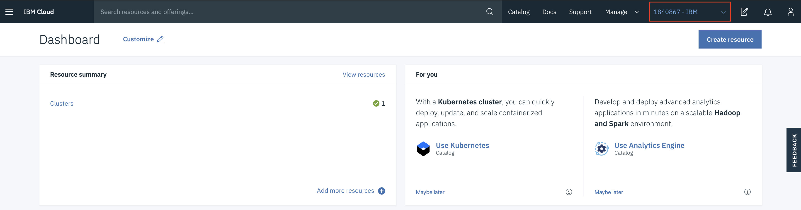
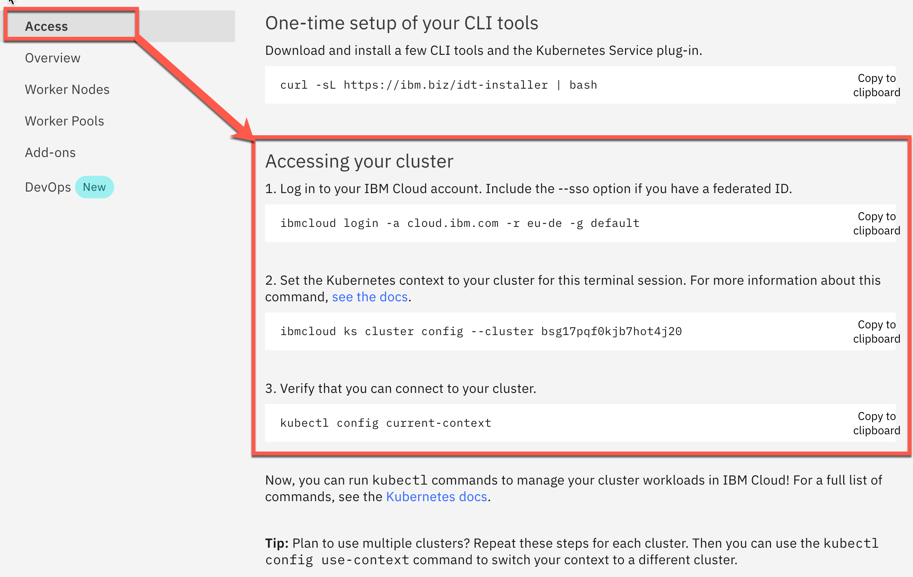

# IBM Cloud Shell

For this workshop we'll be using the IBM Cloud Shell. The IBM Cloud Shell is a cloud-based shell workspace that you can access through your browser. It's preconfigured with the full IBM Cloud CLI and other 3rd party CLIs like OpenShift's `oc`, Helm's `helm` and Kubernetes' `kubectl`. Here you find the list of installed [plug-ins](https://cloud.ibm.com/docs/cloud-shell?topic=cloud-shell-plugins-tools).

### Step 1: Setup the IBM Cloud Shell terminal session

When using Kubernetes on IBM Cloud no client side setup is required for this workshop. Instead we will use the IBM Cloud Shell (Beta) which comes with all necessary CLIs (command line tools).

In your browser, login to the [IBM Cloud](https://cloud.ibm.com) Dashboard. Make sure you select your own account in the account list at the top, then click on the IBM Cloud Shell icon.

That opens a new browser tab with your IBM Cloud Shell session. 


Note: Your workspace includes 500 MB of temporary storage. This session will close after an hour of inactivity. If you don't have any active sessions for an hour or you reach the 30-hour weekly usage limit, your workspace data is removed.

You should see you personal ID as `Current account: [User]'s Account'`:


When you using Kubernetes locally for that example, you need a local terminal and the following tools: 

* [git](https://git-scm.com/book/en/v2/Getting-Started-Installing-Git)
* [curl](https://curl.haxx.se/download.html)
* [kubectl](https://kubernetes.io/docs/reference/kubectl/overview/)
* [yarn](https://yarnpkg.com)
* [mvn](https://maven.apache.org/ref/3.6.3/maven-embedder/cli.html)
* [Node.js]((https://nodejs.org/en/))
* Java 9 or higher

### Step 2: Get the Code

In the IBM Cloud Shell execute the following command:

```
git clone https://github.com/IBM/cloud-native-starter.git
cd cloud-native-starter/security
ROOT_FOLDER=$(pwd)  
```

### Step 3. Get Access to Kubernetes

Open provided Kubernetes cluster again in your browser tab, with the IBM Cloud web console. Switch from your **own** account to provided  **IBM account**.

* Switch back to the  **1840867-IBM** account by clicking on the account selection drop down in the top navigation bar.



* Click on your cluster.


* Now select `Access` on the left-hand side, here you see all steps to access your Kubernetes Cluster in a terminal session. You can easily copy and paste the given commands.



* Copy and paste the commands in your open IBM Cloud Shell terminal session.

| Browser tab - IBM Cloud web console | Broswer tab - IBM CLoud Shell  |
| - | - |
||  |

_Note:_ To access the provided IBM Cloud Kubernetes Cluster and select after the login command `2` as the account for the current IBM Cloud Shell terminal session. 

Example:

```sh
Select an account:
1. Thomas Südbröcker's Account (641XXXXXXXXe) <-> 123456
2. Provided IBM account's Account (cf4dXXXXXe) <-> 234567
Enter a number> 2
```

### Step 4. Create a environment variable `$CLUSTER_NAME`

* Enter the following command displays the name of your cluster, its ID, and a few other things.

```sh
ibmcloud ks cluster ls
```

Example output:

```sh
Name                               ID                     State      Created        Workers   Location    Version                   Resource Group Name   Provider   
mycluster-ams03-b3c.4x16         bsk19dhd0efh3hp3b05g   normal     1 day ago      2         Dallas      1.17.9_1534               default               classic
```

* Create an environment variable $CLUSTER_NAME that contains the name of your cluster.

```sh
export MYCLUSTER=your_pre_provisioned_clustername
```
